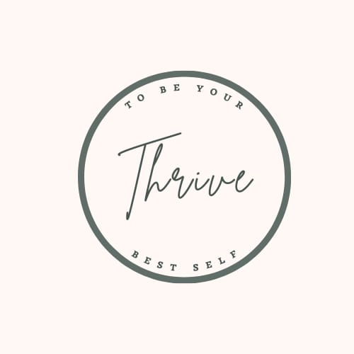

# 🌟 Thrive – Your Side Hustle


**Thrive** is a student-led initiative designed to empower and showcase student-run businesses and talents within the Sathyabama University campus. Built using **HTML**, **CSS**, and **JavaScript**, Thrive is an interactive web platform that promotes entrepreneurial efforts, facilitates community support, and provides various services—from delivery assistance to marketing workshops.

---

## 🚀 Project Overview

> “The online platform to promote your businesses and start-up ideas within the comfort of our college campus.”

Thrive provides a seamless interface where users can:

- **Explore student-run businesses**
- **Connect with like-minded individuals**
- **Promote their products and services**
- **Attend educational workshops**
- **Engage in collaborative marketing initiatives**

---

## 🎯 Features

### 🛍️ Services Offered
- **Product Delivery** – On-campus or home delivery to save time.
- **Aesthetic Matchmaking** – Connect with peers who share similar interests.
- **Showcase Hub** – Highlight your products publicly on Thrive.
- **Student-Business Collaboration** – Real-world marketing experience.
- **Educational Workshops** – Upskill through training in digital marketing, data analysis, and more.
- **Community Engagement** – Events and competitions to promote local talent.


### 🌟 Featured Clients

Meet some of our thriving student entrepreneurs:
- **Freneta Jewellery**
- **Typically Treats**
- **Sandy's Canvas**
- **H.O.B.A.T**
- **Belle Chic**
- **Sandy's Clay Cottage**


---

## 🧠 About Us

We’re a team of **five passionate women** from Sathyabama University. Our mission is to create a platform where **students connect, collaborate, and grow**—both personally and professionally.

### 💡 Our Mission
- Build a community of aspiring entrepreneurs
- Offer meaningful exposure and visibility
- Equip students with real-world business skills



---

## 🛠️ Tech Stack

| Frontend     | Styling      | Scripts     | Assets         |
|--------------|--------------|-------------|----------------|
| HTML5        | CSS3 (custom + responsive) | JavaScript (vanilla) | Google Fonts, Ionicons |

---

## 🖥️ Setup Instructions

1. **Clone the repository**
   ```bash
   git clone https://github.com/yourusername/thrive-hustle.git
   ```
2. **Open `index.html` in your browser**

> No backend or build tools required. Just a modern browser and your passion to explore student-led businesses!

---

## 📩 Contact Us

- 📧 Email: thrive5@gmail.com / thrives5@gmail.com  
- 📍 Location: Sathyabama University, Chennai, Tamil Nadu

---

## 📝 License

This project is licensed under the **MIT License**.

```
MIT License

Copyright (c) 2023 Thrive

Permission is hereby granted, free of charge, to any person obtaining a copy
of this software and associated documentation files (the "Software"), to deal
in the Software without restriction, including without limitation the rights
to use, copy, modify, merge, publish, distribute, sublicense, and/or sell
copies of the Software, and to permit persons to whom the Software is
furnished to do so, subject to the following conditions:

The above copyright notice and this permission notice shall be included in
all copies or substantial portions of the Software.

THE SOFTWARE IS PROVIDED "AS IS", WITHOUT WARRANTY OF ANY KIND, EXPRESS OR
IMPLIED, INCLUDING BUT NOT LIMITED TO THE WARRANTIES OF MERCHANTABILITY,
FITNESS FOR A PARTICULAR PURPOSE AND NONINFRINGEMENT. IN NO EVENT SHALL THE
AUTHORS OR COPYRIGHT HOLDERS BE LIABLE FOR ANY CLAIM, DAMAGES OR OTHER
LIABILITY, WHETHER IN AN ACTION OF CONTRACT, TORT OR OTHERWISE, ARISING FROM,
OUT OF OR IN CONNECTION WITH THE SOFTWARE OR THE USE OR OTHER DEALINGS IN
THE SOFTWARE.
```

---

## 🤝 Acknowledgments

Thanks to every student who believed in their dreams and dared to hustle. Thrive is dedicated to you.

---

> Ready to hustle? Click below 👇  
[](#)
